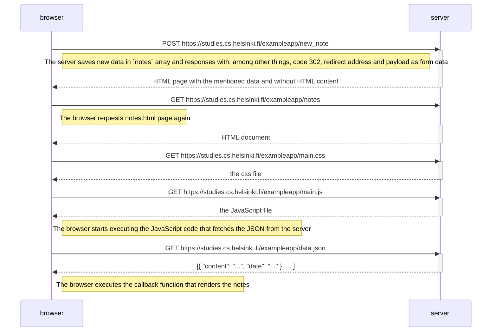

```mermaid	
sequenceDiagram
	participant browser
	participant server
	
	browser->>server: POST https://studies.cs.helsinki.fi/exampleapp/new_note
	activate server
	Note left of server: The server saves new data in `notes` array and responses with, among other things, code 302, redirect address and payload as form data
    	server-->>browser: HTML page with the mentioned data and without HTML content
    	deactivate server

    	browser->>server: GET https://studies.cs.helsinki.fi/exampleapp/notes
    	Note right of browser: The browser requests notes.html page again
    	activate server
		server-->>browser: HTML document
		deactivate server

    	browser->>server: GET https://studies.cs.helsinki.fi/exampleapp/main.css
    	activate server
    	server-->>browser: the css file
    	deactivate server

    	browser->>server: GET https://studies.cs.helsinki.fi/exampleapp/main.js
    	activate server
    	server-->>browser: the JavaScript file
    	deactivate server

    	Note right of browser: The browser starts executing the JavaScript code that fetches the JSON from the server

    	browser->>server: GET https://studies.cs.helsinki.fi/exampleapp/data.json
    	activate server
    	server-->>browser: [{ "content": "...", "date": "..." }, ... ]
    	deactivate server

    	Note right of browser: The browser executes the callback function that renders the notes

```
