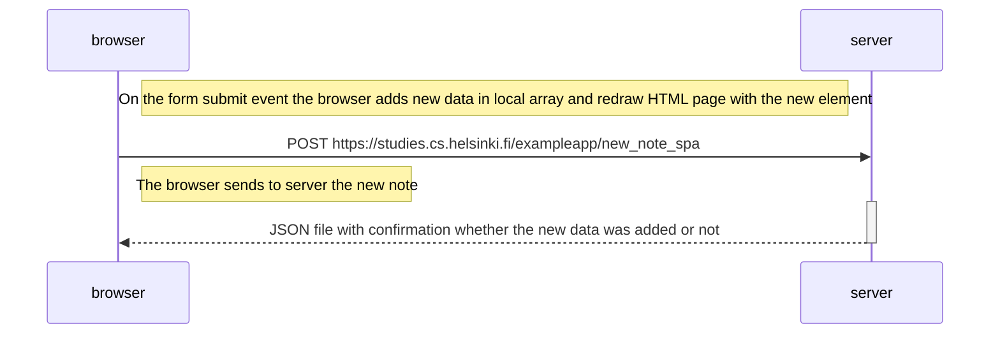

```mermaid
sequenceDiagram
	participant browser
	participant server

    Note right of browser: On the form submit event the browser adds new data in local array and redraw HTML page with the new element
    browser->>server: POST https://studies.cs.helsinki.fi/exampleapp/new_note_spa
    Note right of browser: The browser sends to server the new note
    activate server
	server-->>browser: JSON file with confirmation whether the new data was added or not
	deactivate server
```
